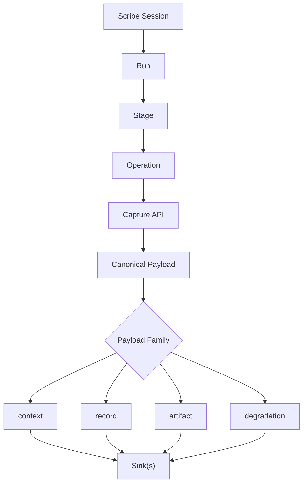

<div align="center">
  <h1>🖋 Scribe</h1>
  <p><em>ML Observability 워크플로를 위한 Local-First Capture SDK</em></p>

  [](https://github.com/eastlighting1/Scribe/actions/workflows/ci.yml)
  [](https://github.com/eastlighting1/Scribe/actions/workflows/repository-policy.yml)
  [](https://github.com/eastlighting1/Scribe/actions/workflows/dependency-audit.yml)
  [](https://github.com/eastlighting1/Scribe/actions/workflows/build-inspection.yml)
  [](./pyproject.toml)
  [](https://github.com/astral-sh/ruff)

  [**English**](./README.md) · [**한국어**](./README.ko.md)
</div>

---

**Scribe**는 ML observability 스택의 Python capture 라이브러리입니다.

이 라이브러리는 런타임 코드가 lifecycle scope를 구조적으로 열고, canonical observability payload를 emit하고, durable output을 등록하고, degraded capture를 증거로 보존하고, 이 모든 것을 capability-based sink로 dispatch할 수 있게 해줍니다. `Scribe`는 canonical contract, validation, serialization 측면에서 `Spine`과 강하게 정렬되어 있지만, sink boundary에서는 vendor-agnostic한 성격을 유지합니다.

training job, evaluation pipeline, batch workflow가 런타임 truth를 제각각의 로그, 메트릭, 파일 경로에 흩뿌리게 두는 대신, Scribe는 워크플로가 실제로 실행되는 동안 그 truth를 일관되게 기록하기 위한 **하나의 capture-side SDK**를 제공합니다.

## 왜 Scribe인가

ML 시스템은 보통 같은 지점에서 운영적으로 모호해집니다:

- 어떤 run이 이 metric을 만들었는가
- 어떤 stage가 이 event를 emit했는가
- 어떤 request나 step이 이 span을 만들었는가
- 어떤 output file이 어떤 execution context에 속하는가
- capture가 깨끗하게 성공했는가, 아니면 부분적으로만 보존됐는가
- backend가 아직 없을 때 local-first observability data는 어디로 가야 하는가

> **Scribe는 이 모호함을 runtime capture 계층에서 멈추기 위해 존재합니다.**

Scribe를 사용하면 팀은 다음을 구조적으로 instrumentation할 수 있습니다:

- **Lifecycle Context:** `run -> stage -> operation`
- **Observed Facts:** 구조화된 event, metric, span, lifecycle record
- **Durable Outputs:** binding-aware artifact registration
- **Operational Outcomes:** `CaptureResult`, `BatchCaptureResult`, degradation evidence
- **Delivery Paths:** `context`, `record`, `artifact`, `degradation` 전반에 걸친 capability-based sink

## 핵심 아이디어

Scribe는 runtime capture flow를 통해 이해하는 것이 가장 쉽습니다. lifecycle context를 명시적으로 열고, captured fact를 canonical payload로 만들고, 이 payload를 family별로 하나 이상의 sink에 dispatch합니다.



### 강한 기본값

- execution context를 추측하지 말고 explicit lifecycle scope를 연다.
- run boundary에서 lifecycle과 environment truth를 자동으로 캡처한다.
- capture quality를 `None` 뒤에 숨기지 말고 structured outcome을 반환한다.
- degraded capture를 조용한 구현 노이즈가 아니라 observability truth로 다룬다.
- 특정 backend를 가정하지 않으면서도 local durable storage를 기본 경로로 제공한다.

## 설치

저장소를 클론합니다:

```bash
git clone https://github.com/eastlighting1/Scribe.git
cd Scribe
```

로컬 개발에서는 `Spine`과 `Scribe`를 함께 editable mode로 설치합니다:

```bash
pip install -e ../Spine -e .[dev]
```

설치가 잘 되었는지 확인하려면:

```bash
python -c "import scribe; print(scribe.__file__)"
```

테스트를 실행하려면:

```bash
pytest tests
```

## 빠른 시작

Scribe의 기본 사용 루프는 단순합니다: **1) 세션 생성 -> 2) lifecycle scope 열기 -> 3)
runtime fact 캡처 -> 4) structured result 확인.**

```python
from pathlib import Path

from scribe import EventEmission, LocalJsonlSink, MetricEmission, Scribe

scribe = Scribe(
    project_name="nova-vision",
    sinks=[LocalJsonlSink(Path("./.scribe"))],
)

with scribe.run("baseline-train") as run:
    run.event("run.note", message="baseline training started")

    with run.stage("prepare-data") as stage:
        stage.emit_metrics(
            [
                MetricEmission("data.rows", 128_000, aggregation_scope="dataset"),
                MetricEmission("data.features", 512, aggregation_scope="dataset"),
            ]
        )

    with run.stage("train") as stage:
        stage.emit_events(
            [
                EventEmission("epoch.started", "epoch 1 started"),
                EventEmission("epoch.completed", "epoch 1 completed"),
            ]
        )
        stage.register_artifact("checkpoint", Path("./artifacts/model.ckpt"), allow_missing=True)
```

이 흐름은 네 가지 payload family를 만듭니다:

- `context`: `Project`, `Run`, `StageExecution`, `OperationContext`, `EnvironmentSnapshot`
- `record`: event, metric, span, lifecycle record
- `artifact`: binding-aware artifact payload
- `degradation`: fidelity가 떨어졌을 때의 capture evidence

## Public API 형태

Top-level:

- `Scribe.run(...)`
- `Scribe.event(...)`
- `Scribe.metric(...)`
- `Scribe.span(...)`
- `Scribe.register_artifact(...)`
- `Scribe.emit_events(...)`
- `Scribe.emit_metrics(...)`

Scope-level:

- `RunScope.stage(...)`
- `StageScope.operation(...)`
- `scope.event(...)`
- `scope.metric(...)`
- `scope.span(...)`
- `scope.register_artifact(...)`
- `scope.emit_events(...)`
- `scope.emit_metrics(...)`

Result model:

- `CaptureResult`
- `BatchCaptureResult`
- `PayloadFamily`
- `DeliveryStatus`

## Local-First 저장소

`LocalJsonlSink`는 payload family별로 append-friendly한 JSONL 파일 하나씩을 씁니다:

- `contexts.jsonl`
- `records.jsonl`
- `artifacts.jsonl`
- `degradations.jsonl`

이렇게 하면 local JSONL을 아키텍처 전체의 source of truth로 만들지 않으면서도, 팀은 offline-capable한 기본 경로를 가질 수 있습니다. 이것은 단지 Scribe의 vendor-agnostic sink boundary 뒤에 있는 하나의 구체적인 adapter일 뿐입니다.

## 문서

Scribe의 runtime model, capture pattern, sink 동작, API를 더 깊게 보려면 아래 문서를 읽어보세요:

| 가이드 | English | 한국어 |
|---|---|---|
| **메인 가이드** | [README.md](./docs/USER_GUIDE.en.md) | [README.md](./docs/USER_GUIDE.ko.md) |
| **API 레퍼런스** | [api-reference.md](./docs/en/api-reference.md) | [api-reference.md](./docs/ko/api-reference.md) |

**권장 읽기 순서:**

1. [Getting Started](./docs/en/getting-started.md)
2. [Core Concepts](./docs/en/core-concepts.md)
3. [Capture Patterns](./docs/en/capture-patterns.md)
4. [Sinks and Storage](./docs/en/sinks-and-storage.md)
5. [Artifacts](./docs/en/artifacts.md)
6. [Degradation and Errors](./docs/en/degradation-and-errors.md)

## 저장소 구조

- `src/scribe`: 공개 패키지와 구현
- `examples`: 실행 가능한 workflow 예제
- `tests`: runtime 및 capture behavior 테스트
- `docs/en` & `docs/ko`: 상세 문서

## 현재 상태

이 저장소는 아직 초기 단계이지만, 핵심 capture surface는 이미 작동합니다:

- ✅ explicit `run -> stage -> operation` lifecycle scope
- ✅ 자동 lifecycle 및 environment capture
- ✅ 구조화된 event, metric, span, artifact emission
- ✅ degraded capture evidence
- ✅ local-first JSONL persistence
- ✅ payload family 기반 sink dispatch
