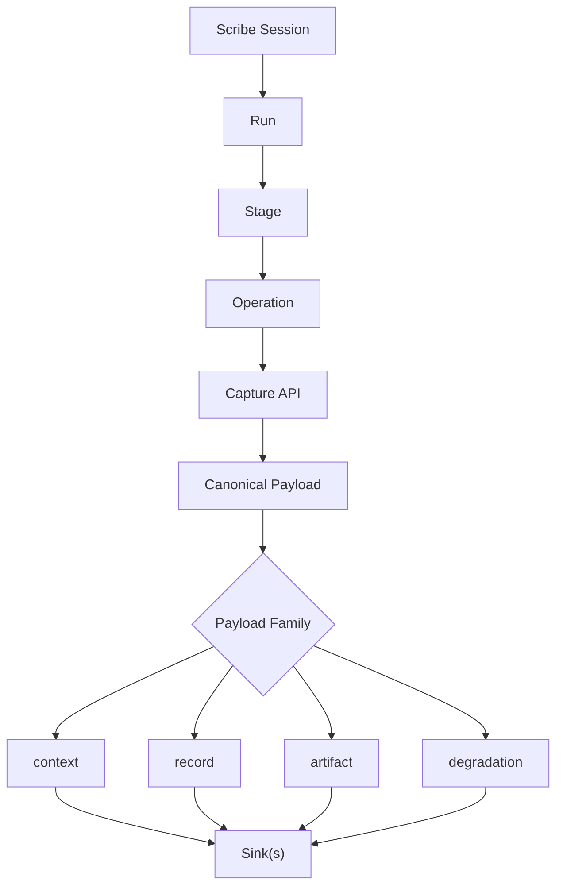

<div align="center">
  <h1>🖋 Scribe</h1>
  <p><em>A Local-First Capture SDK for ML Observability Workflows</em></p>

  [](https://github.com/eastlighting1/Scribe/actions/workflows/ci.yml)
  [](https://github.com/eastlighting1/Scribe/actions/workflows/repository-policy.yml)
  [](https://github.com/eastlighting1/Scribe/actions/workflows/dependency-audit.yml)
  [](https://github.com/eastlighting1/Scribe/actions/workflows/build-inspection.yml)
  [](./pyproject.toml)
  [](https://github.com/astral-sh/ruff)

  [**Docs (EN)**](./docs/USER_GUIDE.en.md) · [**Docs (KO)**](./docs/USER_GUIDE.ko.md)
</div>

---

**Scribe** is the Python capture library of the ML observability stack.

It gives runtime code a structured way to open lifecycle scopes, emit canonical observability payloads, register durable outputs, preserve degraded capture as evidence, and dispatch everything to capability-based sinks. `Scribe` is tightly aligned with `Spine` for canonical contracts, validation, and serialization, but it stays vendor-agnostic at the sink boundary.

Instead of letting training jobs, evaluation pipelines, and batch workflows scatter their runtime truth across ad hoc logs, metrics, and file paths, Scribe provides **one capture-side SDK** for recording that truth consistently while the workflow is actually running.

## Why Scribe

ML systems usually become operationally ambiguous in the same places:

- which run produced this metric
- which stage emitted this event
- which request or step generated this span
- which output file belongs to which execution context
- whether capture succeeded cleanly or only partially
- where local-first observability data should go before a backend exists

> **Scribe exists to stop that ambiguity at the runtime capture layer.**

With Scribe, teams can instrument:

- **Lifecycle Context:** `run -> stage -> operation`
- **Observed Facts:** structured events, metrics, spans, and lifecycle records
- **Durable Outputs:** binding-aware artifact registration
- **Operational Outcomes:** `CaptureResult`, `BatchCaptureResult`, and degradation evidence
- **Delivery Paths:** capability-based sinks across `context`, `record`, `artifact`, and `degradation`

## Core Ideas

Scribe is easiest to understand through its runtime capture flow. Lifecycle context is opened explicitly, captured facts are turned into canonical payloads, and those payloads are dispatched by family to one or more sinks.



### Strong Defaults

- Open explicit lifecycle scopes instead of guessing execution context.
- Capture lifecycle and environment truth automatically at run boundaries.
- Return structured outcomes rather than hiding capture quality behind `None`.
- Treat degraded capture as observability truth, not as silent implementation noise.
- Keep local durable storage available without assuming a specific backend product.

## Installation

Clone the repository:

```bash
git clone https://github.com/eastlighting1/Scribe.git
cd Scribe
```

For local development, install `Spine` and `Scribe` together in editable mode:

```bash
pip install -e ../Spine -e .[dev]
```

To verify the installation:

```bash
python -c "import scribe; print(scribe.__file__)"
```

To run the test suite:

```bash
pytest tests
```

## Quick Start

The basic Scribe usage loop is simple: **1) Create a session -> 2) Open a lifecycle scope -> 3)
Capture runtime facts -> 4) Inspect structured results.**

```python
from pathlib import Path

from scribe import EventEmission, LocalJsonlSink, MetricEmission, Scribe

scribe = Scribe(
    project_name="nova-vision",
    sinks=[LocalJsonlSink(Path("./.scribe"))],
)

with scribe.run("baseline-train") as run:
    run.event("run.note", message="baseline training started")

    with run.stage("prepare-data") as stage:
        stage.emit_metrics(
            [
                MetricEmission("data.rows", 128_000, aggregation_scope="dataset"),
                MetricEmission("data.features", 512, aggregation_scope="dataset"),
            ]
        )

    with run.stage("train") as stage:
        stage.emit_events(
            [
                EventEmission("epoch.started", "epoch 1 started"),
                EventEmission("epoch.completed", "epoch 1 completed"),
            ]
        )
        stage.register_artifact("checkpoint", Path("./artifacts/model.ckpt"), allow_missing=True)
```

This produces four payload families:

- `context`: `Project`, `Run`, `StageExecution`, `OperationContext`, `EnvironmentSnapshot`
- `record`: events, metrics, spans, and lifecycle records
- `artifact`: binding-aware artifact payloads
- `degradation`: capture evidence when fidelity drops

## Public API Shape

Top-level:

- `Scribe.run(...)`
- `Scribe.event(...)`
- `Scribe.metric(...)`
- `Scribe.span(...)`
- `Scribe.register_artifact(...)`
- `Scribe.emit_events(...)`
- `Scribe.emit_metrics(...)`

Scope-level:

- `RunScope.stage(...)`
- `StageScope.operation(...)`
- `scope.event(...)`
- `scope.metric(...)`
- `scope.span(...)`
- `scope.register_artifact(...)`
- `scope.emit_events(...)`
- `scope.emit_metrics(...)`

Result models:

- `CaptureResult`
- `BatchCaptureResult`
- `PayloadFamily`
- `DeliveryStatus`

## Local-First Storage

`LocalJsonlSink` writes one append-friendly JSONL file per payload family:

- `contexts.jsonl`
- `records.jsonl`
- `artifacts.jsonl`
- `degradations.jsonl`

This gives teams an offline-capable default path without making local JSONL the architectural source of truth. It is simply one concrete adapter behind Scribe's vendor-agnostic sink boundary.

The built-in sink and recovery surface now also includes:

- `InMemorySink` for tests and object-level assertions
- `S3ObjectSink` for object-store persistence by payload family
- `KafkaSink` for topic-based streaming delivery
- durable local outbox capture when configured through `ScribeConfig`
- `replay_outbox(...)` and `scribe-replay-outbox` for replaying queued failures
- dead-letter promotion for replay entries that keep failing beyond a configured threshold

## Documentation

Dive deeper into Scribe's runtime model, capture patterns, sink behavior, and API:

| Guide | English | Korean |
|---|---|---|
| **Main Guide** | [README.md](./docs/USER_GUIDE.en.md) | [README.md](./docs/USER_GUIDE.ko.md) |
| **API Reference** | [api-reference.md](./docs/en/api-reference.md) | [api-reference.md](./docs/ko/api-reference.md) |

**Recommended Reading Path:**

1. [Getting Started](./docs/en/getting-started.md)
2. [Core Concepts](./docs/en/core-concepts.md)
3. [Capture Patterns](./docs/en/capture-patterns.md)
4. [Sinks and Storage](./docs/en/sinks-and-storage.md)
5. [Artifacts](./docs/en/artifacts.md)
6. [Degradation and Errors](./docs/en/degradation-and-errors.md)

## Repository Layout

- `src/scribe`: Public package and implementation
- `examples`: Runnable workflow examples
- `tests`: Runtime and capture behavior tests
- `docs/en` & `docs/ko`: Detailed documentation

## Current Status

This repository is still early-stage, but the core capture surface is already operational:

- ✅ explicit `run -> stage -> operation` lifecycle scopes
- ✅ automatic lifecycle and environment capture
- ✅ structured event, metric, span, and artifact emission
- ✅ degraded capture evidence
- ✅ local-first JSONL persistence
- ✅ sink-based dispatch across payload families
- ✅ durable outbox recovery and replay
- ✅ built-in S3 and Kafka sink adapters
